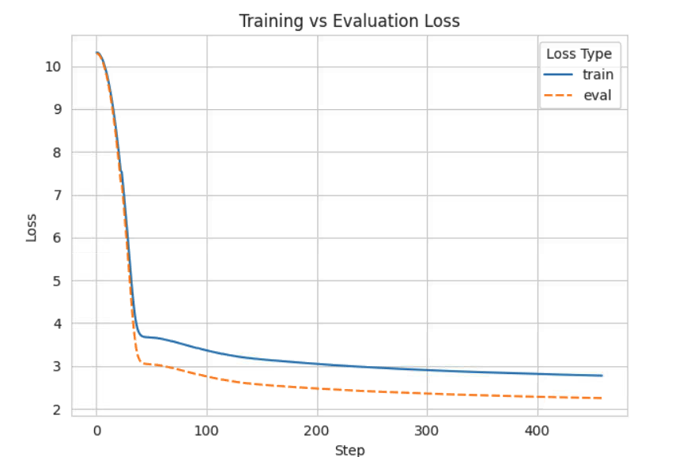

# LLaMA 2 from scratch 🦙

This repository contains a custom implementation of the LLaMA 2 model, as described in the paper "LLaMA 2: Open
Foundation and Fine-Tuned Chat Models" ([ArXiv](https://arxiv.org/abs/2307.09288)). This implementation focuses on
reproducing and extending some of the key features that distinguish LLaMA 2, including RMS-Normalization, the SwiGLU
activation function, Rotary Positional Embeddings (RoPE), increased context length with Grouped-Query Attention (GQA),
and the KV-caching technique.

## Introduction 📘

This project aims to build the LLaMA 2 architecture from scratch, incorporating essential advancements in transformer
models. Key enhancements include RMS-Normalization, SwiGLU activation, Rotary Positional Embeddings, and advanced
attention mechanisms like Grouped-Query Attention, all designed to improve model performance, particularly in handling
longer context windows and enhancing the model's positional understanding.

## Features ✨

- **RMS-Normalization**: A simplified version of layer normalization that stabilizes layer activations and aids in model
  convergence.
- **SwiGLU Activation Function**: Replaces ReLU to improve training performance through more efficient activation.
- **Rotary Positional Embeddings (RoPE)**: Enhances positional awareness at each token by adding distance between
  tokens, featured in RoFormer: Enhanced Transformer with Rotary Position Embedding
  ([ArXiv](https://arxiv.org/abs/2104.09864)).
- **Increased Context Length with GQA**: Expands the context window to 4096 tokens and employs grouped-query attention
  for better long document processing.
- **KV-Cache**: A caching technique to improve decoding efficiency and speed.

### Additional Features Implemented:

- **Inference with Top-P Sampling**: Introduces a more dynamic sampling method that adjusts the number of tokens based
  on their cumulative probability.
- **Data & Training Utilities**: The project adds torch wrappers to onboard with pretriaing on any `.txt` file.

## Installation 🔧

To install the necessary dependencies, clone this repository and run:

```bash
git  clone https://github.com/abdallah197/llama2-from-scratch.git
cd llama2-from-scratch
pip install -r requirements.txt
```

## Training Results 📊

After the training and evaluation phases, we can see a consistent drop in both training and evaluation losses,
indicating the model's learning effectiveness. Below is a plot demonstrating this trend over the training steps.



## Usage 🚀

This section guides you through the process of using the repository for inference, ensuring you can easily generate
outputs from the LLaMA 2 model. Follow these steps to set up and run inference tasks:

### Setting Up

1. **Tokenizer**: Begin by downloading the LLaMA 2 SentencePiece tokenizer model, necessary for preprocessing your input
   text. You can find the tokenizer [here](https://llama.meta.com/llama-downloads/). Ensure that you place the
   downloaded model in an accessible directory within your project.

2. **Model Weights**: You have two options for obtaining the model weights:
    - **Download Pre-trained Weights**: Follow the instructions provided [here](https://llama.meta.com/llama-downloads/)
      to download the official LLaMA model weights.
    - **Train Your Own Model**: Alternatively, you can train your own LLaMA 2 model using this repository.

3. **Configuration**: Configure your inference settings in the `config.py` file. This file should include settings such
   as the path to the model weights, the tokenizer model, and any other inference parameters like the maximum sequence
   length.

### Running Inference

Once you have set up the tokenizer and the model weights, and configured your inference settings, you can run inference
by passing a list of prompts through the command line:
The repo only have [Top P](https://huggingface.co/blog/how-to-generate#top-p-nucleus-sampling) sampling at the moment

```bash
python inference.py "Your first prompt" "Your second prompt"
```

## Configuration ⚙️

The configuration for the model and training is defined using data classes in Python. You can adjust these
configurations to suit your dataset and training needs.
We have three main config dataclasses:

- ModelArgs.
- DataArgs and
- TrainArgs.

To adjust these configurations, modify the respective fields in the data class instances before initializing your model
or training process. For instance, to increase the number of layers and attention heads, you might do:

```
model_args = ModelArgs(n_layers=48, n_heads=48)
train_args = TrainArgs(lr=5e-4, n_epochs=20)
data_args = DataArgs(filepath='new_dataset.txt')
```

I adjusted the model original HP to fit my compute. Here's a summary of the main configuration settings:

- Model Dimensionality: 2048
- Number of Transformer Layers: 32
- Number of Query Attention Heads: 32
- Optional Number of Heads for Key and Value (n_kv_heads): Can be set for specific requirements
- Vocabulary Size: Set dynamically upon loading the llama2 Sentence Piece tokenizer.
- Operating Mode: 'train/inference', when choosing inference, we apply KV-Cache.

## Acknowledgments 💖

This project has been inspired and informed by various resources and individuals in the AI and machine learning
community. We'd like to extend our gratitude to the following:

- [Andrej Karpathy for his tutorial on training a GPT from scratch](https://www.youtube.com/watch?v=kCc8FmEb1nY&t=1058s&ab_channel=AndrejKarpathy).
  His insights into neural network architectures and training methodologies have been invaluable.
- [Umar Jamil's guide on Training LLama2 from scratch](https://www.youtube.com/watch?v=oM4VmoabDAI&ab_channel=UmarJamil).
  This resource provided practical insights and a foundational understanding necessary for this implementation.
- The [Meta LLaMA GitHub repository](https://github.com/meta-llama/llama) has been an essential resource for
  understanding the intricacies of the LLaMA 2 model and its implementation.

I am grateful for the knowledge shared by these individuals and communities, which has significantly contributed to the
development of this project.
